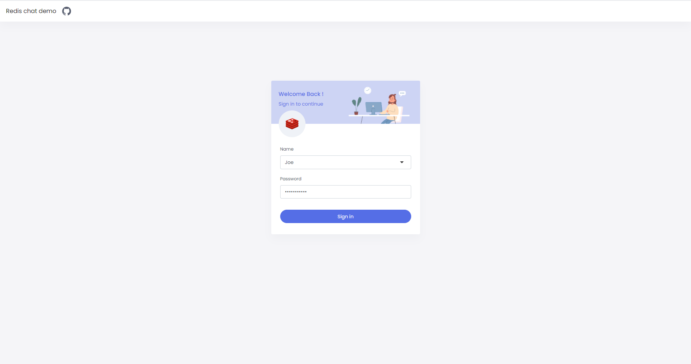
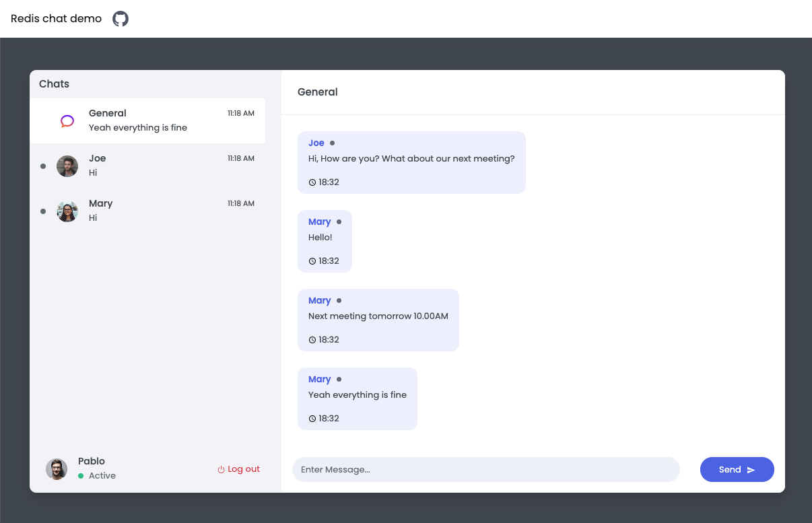

# Basic Redis Chat App Demo (Node.js)

Showcases how to impliment chat app in Node.js, Socket.IO and Redis. This example uses **pub/sub** feature combined with web-sockets for implementing the message communication between client and server.

<a href="https://github.com/redis-developer/basic-redis-chat-app-demo-nodejs/raw/main/docs/screenshot000.png"></a>
<a href="https://github.com/redis-developer/basic-redis-chat-app-demo-nodejs/raw/main/docs/screenshot001.png"></a>

# Overview video

Here's a short video that explains the project and how it uses Redis:

[](https://www.youtube.com/watch?v=miK7xDkDXF0)

## Technical Stacks

- Frontend - _React_, _Socket_ (Socket.IO)
- Backend - _Node.js_, _Redis_

## How it works?

### Initialization

For simplicity, a key with **total_users** value is checked: if it does not exist, we fill the Redis database with initial data.
`EXISTS total_users` (checks if the key exists)

The demo data initialization is handled in multiple steps:

**Creating of demo users:**
We create a new user id: `INCR total_users`. Then we set a user ID lookup key by user name: **_e.g._** `SET username:nick user:1`. And finally, the rest of the data is written to the hash set: **_e.g._** `HSET user:1 username "nick" password "bcrypt_hashed_password"`.

Additionally, each user is added to the default "General" room. For handling rooms for each user, we have a set that holds the room ids. Here's an example command of how to add the room: **_e.g._** `SADD user:1:rooms "0"`.

**Populate private messages between users.**
At first, private rooms are created: if a private room needs to be established, for each user a room id: `room:1:2` is generated, where numbers correspond to the user ids in ascending order.

**_E.g._** Create a private room between 2 users: `SADD user:1:rooms 1:2` and `SADD user:2:rooms 1:2`.

Then we add messages to this room by writing to a sorted set:

**_E.g._** `ZADD room:1:2 1615480369 "{'from': 1, 'date': 1615480369, 'message': 'Hello', 'roomId': '1:2'}"`.

We use a stringified _JSON_ for keeping the message structure and simplify the implementation details for this demo-app.

**Populate the "General" room with messages.** Messages are added to the sorted set with id of the "General" room: `room:0`

### Registration



Redis is used mainly as a database to keep the user/messages data and for sending messages between connected servers.

#### How the data is stored:

- The chat data is stored in various keys and various data types.
  - User data is stored in a hash set where each user entry contains the next values:
    - `username`: unique user name;
    - `password`: hashed password

* User hash set is accessed by key `user:{userId}`. The data for it stored with `HSET key field data`. User id is calculated by incrementing the `total_users`.

  - E.g `INCR total_users`

* Username is stored as a separate key (`username:{username}`) which returns the userId for quicker access.
  - E.g `SET username:Alex 4`

#### How the data is accessed:

- **Get User** `HGETALL user:{id}`

  - E.g `HGETALL user:2`, where we get data for the user with id: 2.

- **Online users:** will return ids of users which are online
  - E.g `SMEMBERS online_users`

#### Code Example: Prepare User Data in Redis HashSet

```JavaScript
const usernameKey = makeUsernameKey(username);
/** Create user */
const hashedPassword = await bcrypt.hash(password, 10);
const nextId = await incr("total_users");
const userKey = `user:${nextId}`;
await set(usernameKey, userKey);
await hmset(userKey, ["username", username, "password", hashedPassword]);

/**
* Each user has a set of rooms he is in
* let's define the default ones
*/
await sadd(`user:${nextId}:rooms`, `${0}`); // Main room
```

### Rooms



#### How the data is stored:

Each user has a set of rooms associated with them.

**Rooms** are sorted sets which contains messages where score is the timestamp for each message. Each room has a name associated with it.

- Rooms which user belongs too are stored at `user:{userId}:rooms` as a set of room ids.

  - E.g `SADD user:Alex:rooms 1`

- Set room name: `SET room:{roomId}:name {name}`
  - E.g `SET room:1:name General`

#### How the data is accessed:

- **Get room name** `GET room:{roomId}:name`.

  - E. g `GET room:0:name`. This should return "General"

- **Get room ids of a user:** `SMEMBERS user:{id}:rooms`.
  - E. g `SMEMBERS user:2:rooms`. This will return IDs of rooms for user with ID: 2

#### Code Example: Get all My Rooms

```JavaScript
const rooms = [];
for (let x = 0; x < roomIds.length; x++) {
    const roomId = roomIds[x];

    let name = await get(`room:${roomId}:name`);
    /** It's a room without a name, likey the one with private messages */
    if (!name) {
        /**
         * Make sure we don't add private rooms with empty messages
         * It's okay to add custom (named rooms)
         */
        const roomExists = await exists(`room:${roomId}`);
        if (!roomExists) {
            continue;
        }

        const userIds = roomId.split(":");
        if (userIds.length !== 2) {
            return res.sendStatus(400);
        }
        rooms.push({
            id: roomId,
            names: [
                await hmget(`user:${userIds[0]}`, "username"),
                await hmget(`user:${userIds[1]}`, "username"),
            ],
        });
    } else {
        rooms.push({
            id: roomId,
            names: [name]
        });
    }
}
return rooms;
```

### Messages

#### Pub/sub

After initialization, a pub/sub subscription is created: `SUBSCRIBE MESSAGES`. At the same time, each server instance will run a listener on a message on this channel to receive real-time updates.

Again, for simplicity, each message is serialized to **_JSON_**, which we parse and then handle in the same manner, as WebSocket messages.

Pub/sub allows connecting multiple servers written in different platforms without taking into consideration the implementation detail of each server.

#### How the data is stored:

- Messages are stored at `room:{roomId}` key in a sorted set (as mentioned above). They are added with `ZADD room:{roomId} {timestamp} {message}` command. Message is serialized to an app-specific JSON string.
  - E.g `ZADD room:0 1617197047 { "From": "2", "Date": 1617197047, "Message": "Hello", "RoomId": "1:2" }`

#### How the data is accessed:

- **Get list of messages** `ZREVRANGE room:{roomId} {offset_start} {offset_end}`.
  - E.g `ZREVRANGE room:1:2 0 50` will return 50 messages with 0 offsets for the private room between users with IDs 1 and 2.

#### Code Example: Send Message

```Javascript
async (message) => {
    /** Make sure nothing illegal is sent here. */
    message = {
        ...message,
        message: sanitise(message.message)
    };
    /**
     * The user might be set as offline if he tried to access the chat from another tab, pinging by message
     * resets the user online status
     */
    await sadd("online_users", message.from);
    /** We've got a new message. Store it in db, then send back to the room. */
    const messageString = JSON.stringify(message);
    const roomKey = `room:${message.roomId}`;
    /**
     * It may be possible that the room is private and new, so it won't be shown on the other
     * user's screen, check if the roomKey exist. If not then broadcast message that the room is appeared
     */
    const isPrivate = !(await exists(`${roomKey}:name`));
    const roomHasMessages = await exists(roomKey);
    if (isPrivate && !roomHasMessages) {
        const ids = message.roomId.split(":");
        const msg = {
            id: message.roomId,
            names: [
                await hmget(`user:${ids[0]}`, "username"),
                await hmget(`user:${ids[1]}`, "username"),
            ],
        };
        publish("show.room", msg);
        socket.broadcast.emit(`show.room`, msg);
    }
    await zadd(roomKey, "" + message.date, messageString);
    publish("message", message);
    io.to(roomKey).emit("message", message);
}
```

### Session handling

The chat server works as a basic _REST_ API which involves keeping the session and handling the user state in the chat rooms (besides the WebSocket/real-time part).

When a WebSocket/real-time server is instantiated, which listens for the next events:

**Connection**. A new user is connected. At this point, a user ID is captured and saved to the session (which is cached in Redis). Note, that session caching is language/library-specific and it's used here purely for persistence and maintaining the state between server reloads.

A global set with `online_users` key is used for keeping the online state for each user. So on a new connection, a user ID is written to that set:

**E.g.** `SADD online_users 1` (We add user with id 1 to the set **online_users**).

After that, a message is broadcasted to the clients to notify them that a new user is joined the chat.

**Disconnect**. It works similarly to the connection event, except we need to remove the user for **online_users** set and notify the clients: `SREM online_users 1` (makes user with id 1 offline).

**Message**. A user sends a message, and it needs to be broadcasted to the other clients. The pub/sub allows us also to broadcast this message to all server instances which are connected to this Redis:

`PUBLISH message "{'serverId': 4132, 'type':'message', 'data': {'from': 1, 'date': 1615480369, 'message': 'Hello', 'roomId': '1:2'}}"`

Note we send additional data related to the type of the message and the server id. Server id is used to discard the messages by the server instance which sends them since it is connected to the same `MESSAGES` channel.

`type` field of the serialized JSON corresponds to the real-time method we use for real-time communication (connect/disconnect/message).

`data` is method-specific information. In the example above it's related to the new message.

#### How the data is stored / accessed:

The session data is stored in Redis by utilizing the [**connect-redis**](https://www.npmjs.com/package/connect-redis) client.

```JavaScript
const session = require("express-session");
let RedisStore = require("connect-redis")(session);
const sessionMiddleware = session({
  store: new RedisStore({ client: redisClient }),
  secret: "keyboard cat",
  saveUninitialized: true,
  resave: true,
});
```

## How to run it locally?

#### Write in environment variable or Dockerfile actual connection to Redis:

```
   REDIS_ENDPOINT_URL = "Redis server URI"
   REDIS_PASSWORD = "Password to the server"
```

#### Run frontend

```sh
cd client
yarn install
yarn start
```

#### Run backend

```sh
yarn install
yarn start
```

## Try it out

#### Deploy to Heroku

<p>
    <a href="https://heroku.com/deploy" target="_blank">
        
    </a>
</p>

#### Deploy to Google Cloud

<p>
    <a href="https://deploy.cloud.run" target="_blank">
        
    </a>
</p>
